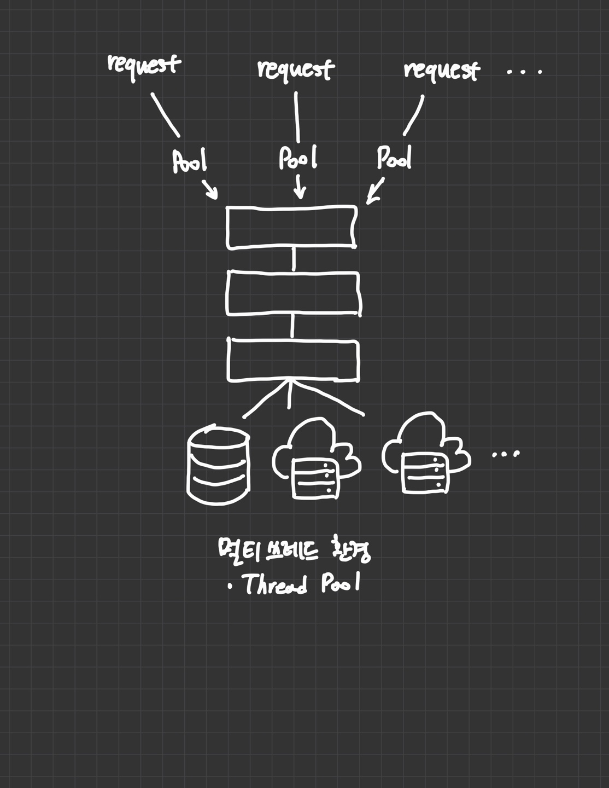
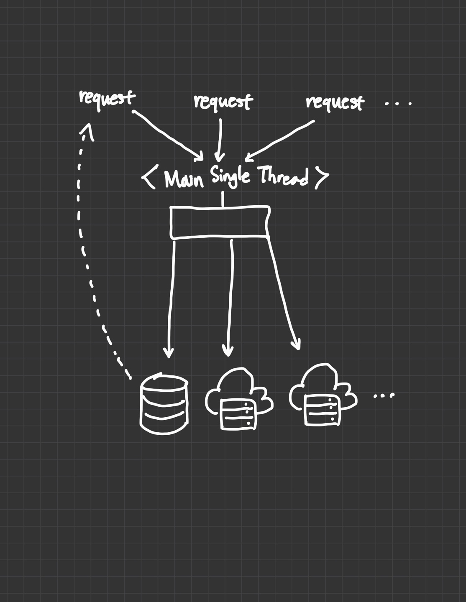

# Node.js

### ***"JavaScript Everywhere"***

- Node.js는 자바스크립트 런타임 환경이고 크롬의 V8 엔진을 이용하고 있다.
- Node.js는 오픈소스, 크로스플랫폼, 백엔드에서 사용되는, 즉, 브라우저 밖에서도 작동할 수 있는 자바스크립트 런타임 환경이다.

### *"Node.js is*
- ***JavaScript Runtime"***
- ***Single Tread"***
- ***Non-Blocking I/O"***
- ***Event-Driven"***

### Node.js API

- Console
- Crypto
- HTTP
- File
- OS
- Path
- Stream
- ...

### Node.js Framework

- Express.js
- Nest.js
- Adonis
- Sails

## Node as Server

- 전형적인 서버

전형적인 서버는 멀티쓰레딩 환경에서 쓰레드 풀이 존재한다. 클라이언트의 요청이 들어올시 요청을 처리하기 위한 쓰레드풀이 생성되고 그 쓰레드풀의 생성개수는 제한적이다. 따라서, 많은 요청이 클라이언트로부터 들어오게 되면 최대치의 쓰레드풀이 생성되고 쓰레드풀들 중 먼저 처리된(클라이언트에게 응답하고 요청처리가 완료된) 쓰레드풀이 다음 요청 건수를 처리할 수 있다.

- Node.js 서버

반면에 Node.js 서버는 하나의 메인 싱글 쓰레드가 존재하여 이 쓰레드는 클라이언트로부터 요청을 받고 해당 요청에 맞는 다음 작업에게 던져놓는(임위하는) 형식으로 처리된다. 즉, 하나의 쓰레드가 요청을 받고 응답처리까지 기다리는 것이 아니라, 요청만 받고 필요한 다음 작업을 할 수 있는 데이터베이스나 네트워크에 위임해두고 다음 요청을 받게 되면서 더 빠른 클라이언트 요청 처리가 가능하다. (다수의 요청을 빠르게 처리 가능)

결론적으로 Node.js는 Non-Blocking I/O, Event-Driven 방식으로 File이나 Database를 읽고 쓰거나 네트워크 처리하는데 효율적이다. 하지만 이러한 병렬적인 처리는 CPU에게 많은 부담을 주기 때문에 CPU가 무거운 작업(image 처리, video 처리)을 필요로 하는데 비효율적일 수 있고 Go언어 같은 언어가 적합할 수 있다.

만일 CPU의 무거운 작업을 필요로 한다면 개별적인 분산 서버를 두거나, AWS 람다, Google Cloud Function을 이용할 수 있다.