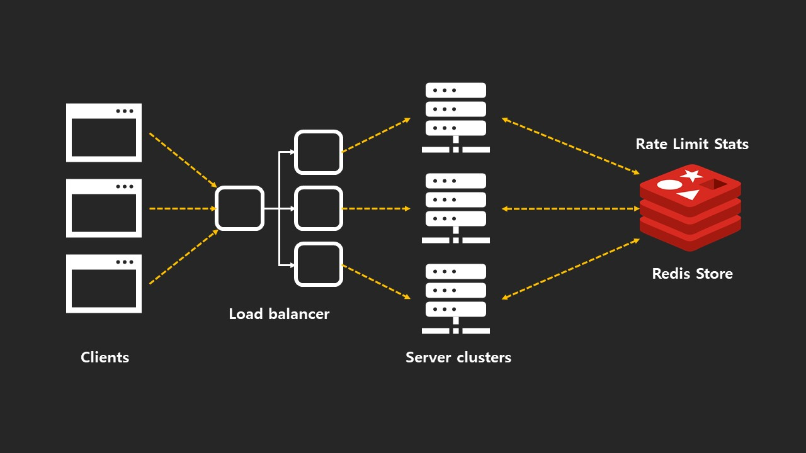

## 목차

- [Rate Limiter?](#rate-limiter)
- [API Management Platforms](#api-management-platforms)
    - [Business Products](#business-products)
    - [Cloud Services](#cloud-services)
- [Why rate limit API?](#why-rate-limit-api)
    - [429 Too Many Requests](#429-too-many-requests)
- [Rate limiting in production](#rate-limiting-in-production)
- [Rate limiting algorithms](#rate-limiting-algorithms)
    - [Fixed window](#fixed-window)
    - [Sliding window](#sliding-window)
    - [Leaky bucket](#leaky-bucket)
    - [Token bucket](#token-bucket)
- [Client side considerations](#client-side-considerations)
- [NodeJS useful middleware](#nodejs-useful-middleware)

# Rate Limiter?

만일 아무 제약을 걸지 않은 상태라면 수많은 클라이언트가 동시다발적으로 서버에 요청을 하는 경우, 서버에 과부하가 걸리게 되며 결국에는 서버가 셧다운되는 상황을 초래한다.  
이러한 위험을 방지하기 위해 Rate Limiter를 사용하게 된다.  
즉, 동시다발적으로 너무 많은 요청을 보내는 것을 방지하여 서버의 과부화를 줄이기 위해 사용한다.

# API Management Platforms

### Business Products

- Tyk.io
- apigee

### Cloud Services

- AWS API Gateway
- Google Cloud API Gateway

# Why rate limit API?

- **System protection** by **DDos** ( Denial-Of-Service Attack(DoS attack) )  
디도스와 같은 공격에 대한 방어

- **System stability**  
시스템 안정성을 위한, 매 24시간 동작

- **Balanced Use**  
사용자들간의 공평성을 위해

- **Differentiate Level of Service**  
권한에 따른 API 허용 범위, API 사용량을 지정

### 429 Too Many Requests

Rate limit 제약에 걸릴시 응답하는 Http Status Code 값
> 429 응답시 Header에 Retry-After: 3600 같은 값을 포함하는 것을 권고함

# Rate limiting in production

# Rate limiting algorithms

### Fixed window

Fixed = 정하다  
window = 특정한 시간대  

Fixed window는 특정한 시간 프레임 안에 몇가지의 요청을 처리할 수 있을지에 대해 정해놓고 그 이상의 요청에 한에서는 Reject를 하는 방식이다.

하지만, 특정 윈도우를 넘어가지 전과 그 후 이 짧은 시간에 다량의 요청을 처리해야하는 경우가 생길 수 있으며, 이때 서버 과부하가 생기게 된다.

### Sliding window

Fixed window의 단점을 개선한 알고리즘이다.  
즉, sliding window는 앞의 window와 그 후의 window를 비교하며 요청을 처리한다.

### Leaky bucket

Bursty flow -> bucket -> constant rate

동시다발적으로 방생되는 요청을 bucket에 담아놓고 bucket에 담겨는 요청을 일정간격으로 처리하여 시스템 과부화를 줄이는 알고리즘이다.

하지만, 특정 시간에 API 요청 스파이크(spike)가 발생하는 서비스라면 bucket이 꽉 찼을 경우 그 외에 들어오는 요청을 처리할 수 없기 때문에 이러한 환경에서는 많은 API를 처리할 수 없기 때문에 좋지 못하다.

### Token bucket

Leaky bucket의 단점을 보완한 알고리즘이다.

간단하게 말하자면 버켓에 요청을 담을때 해당 요청에 토큰과 함께 버켓에 담아주며, 처리된 요청건은 토큰만 다시 버켓에 반납하게 된다. 이렇게 토큰이 버켓을 계속 순환하게 되면서 다량의 API를 처리할 수 있게 된다.

# Client side considerations

만일 클라이언트가 너무 많은 요청을 보내어 서버로부터 429 응답 코드를 받았다면 재시도/재요청을 해야한다.  

재시도 시점은 보통 429 응답 코드와 같이 담겨진 Retry-After 값을 가지고 다시 요청을 하게 되는데 이떄 Retry-After 값은 점진적으로 값이 설계되어 있어야한다.  
(ex) 1초, 2초, 3초, ... (X) / 2초, 4초, 8시, 16초, ... (O))

**Jitter**  
Retry-After 값으로 재요청을 할때 그 값 그대로 요청을 하기 보다는 조금씩 값을 비틀어서(다르게해서) 재시도를 하는게 좋다.   
ex)  
429 (Retry-After: 1000(1초)) request -> 1000 -> Retry -> (X)  
429 (Retry-After: 1000(1초)) request -> 900/1100 -> Retry -> (O) 

이렇게 하는 이유는 예를 들어 세 클라이언트가 각각 같은 Retry-After 값으로 재시도를 하게되는 경우 결국에는 그 다음 시간대에 동시에 보내게 되므로 같은 결과를 초래할 수 있다. 그래서 각자 조금씩 시간을 앞뒤로 비틀어서 재시도를 하는게 좋다.

# NodeJS useful middleware

https://github.com/nfriedly/express-rate-limit