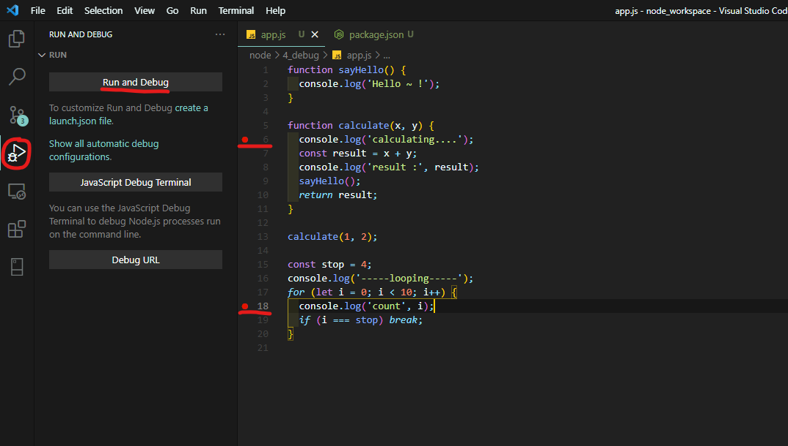

## 목차

- [디버깅](#디버깅)
  - [Visual Studio Code 디버깅 실행 방법](#visual-studio-code-디버깅-실행-방법)
- [Visual Studio Code 디버깅 사용 벙법](#visual-studio-code-디버깅-사용-벙법)
  - [디버깅 사용 툴 설명](#디버깅-사용-툴-설명)
    - [1. Continue](#1-continue)
    - [2. Step Over](#2-step-over)
    - [3. Step Into](#3-step-into)
    - [4. Step Out](#4-step-out)
    - [5. Restart](#5-restart)
    - [6. Stop / Disconnect](#6-stop--disconnect)
  - [디버깅 상태 보기](#디버깅-상태-보기)
    - [변수 확인 (VARIABLES)](#변수-확인-variables)
    - [Expressions 확인 (WATCH)](#expressions-확인-watch)
    - [CALL STACK 확인](#call-stack-확인)
    - [사용되고 있는 스크립트 확인](#사용되고-있는-스크립트-확인)
    - [BREAKPOINTS 리스트 확인](#breakpoints-리스트-확인)
    - [DEBUGGING 콘솔창](#debugging-콘솔창)
  - [`nodemon`으로 디버깅 실행하기](#nodemon으로-디버깅-실행하기)

# 디버깅

- 디버깅(Debugging) : 코드를 하나하나 실행하면서 문제를 해결해 나가는 과정

## Visual Studio Code 디버깅 실행 방법



1. `Breakpoint` 걸기
   - 해당 코드줄 번호 옆에 마우스 올리면 생성되는 아이콘 클릭시 `Breakpoint`가 표시됨
2. 좌측 사이드바 대메뉴에서 Run and Debug 버튼(세모와 벌레 모양의 아이콘) 클릭
   - 단축키 : `Ctrl` + `Shift` + `D`
3. `Run and Debug` 버튼 클릭 후 디버깅 실행
4. 처음 실행시 상단에 셀렉트박스가 뜨는데 거기서 `Node.js`를 클릭해준다.
   


5. 디버깅이 실행되면 처음 `Breakpoint`가 걸려있는 코드줄에 멈춘다.


# Visual Studio Code 디버깅 사용 벙법

## 디버깅 사용 툴 설명

### 1. Continue


- 단축키 : `F5`
- 다음 Breakpoint까지 실행하기

### 2. Step Over


- 단축키 : `F10`
- 다음 아래 줄 코드 실행

### 3. Step Into


- 단축키 : `F11`
- 실행될 해당 함수 진입

### 4. Step Out


- 단축키 : `Shift` + `F11`
- 진입한 함수 빠져나오기

### 5. Restart


- 단축키 : `Ctrl` + `Shift` + `F5`
- 디버깅 재시작

### 6. Stop / Disconnect


- Stop 단축키 : `Shift` + `F5`
- Disconnect 단축키 :  `Alt` + `Shift` + `F5`
- 디버깅 종료

## 디버깅 상태 보기

### 변수 확인 (VARIABLES)


- 해당 영역에서 로컬 변수랑, 클로저, 글로벌 변수들을 확인할 수 있다.

### Expressions 확인 (WATCH)


- 해당 WATCH 영역에서 Expression을 추가해주고 그 값 상태를 계속 확인 할 수 있다.

### CALL STACK 확인


### 사용되고 있는 스크립트 확인


### BREAKPOINTS 리스트 확인


- 현재 걸려있는 Breakpoints 리스트를 확인할 수 있다.

### DEBUGGING 콘솔창


## `nodemon`으로 디버깅 실행하기

- launch.json

```json
{
  // Use IntelliSense to learn about possible attributes.
  // Hover to view descriptions of existing attributes.
  // For more information, visit: https://go.microsoft.com/fwlink/?linkid=830387
  "version": "0.2.0",
  "configurations": [
    {
      "type": "pwa-node",
      "request": "launch",
      "name": "Launch Program",
      "skipFiles": [
        "<node_internals>/**"
      ],
      "program": "${workspaceFolder}\\node\\3_debug\\app.js",
      "runtimeExecutable": "nodemon", // 추가한 부분 1
      "restart": true // 추가한 부분 2
    }
  ]
}
```

- `nodemon` 으로 디버깅 실행시 소스 코드를 변경할때마다 재실행되면서 디버깅 싱크가 안맞는 문제를 해결할 수 있다.
- 만일 Window 환경에서 nodemon으로 디버깅을 실행시키고자 한다면 글로벌에 nodemon을 설치해주자.

```bash
$ npm i -g nodemon
```