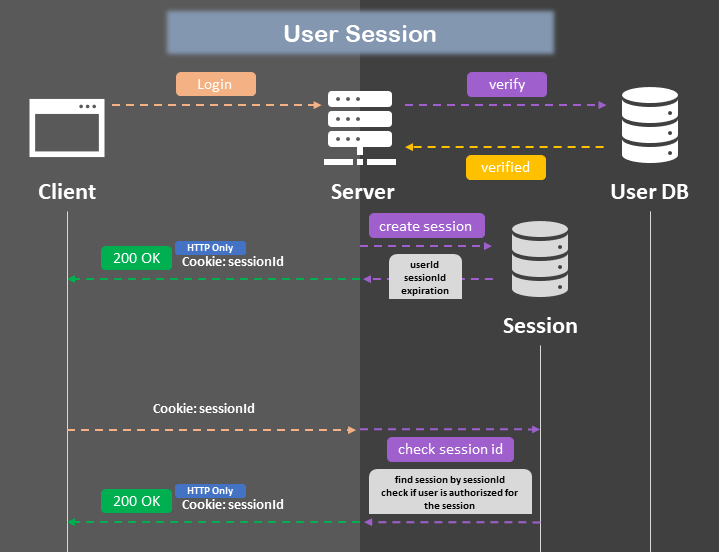
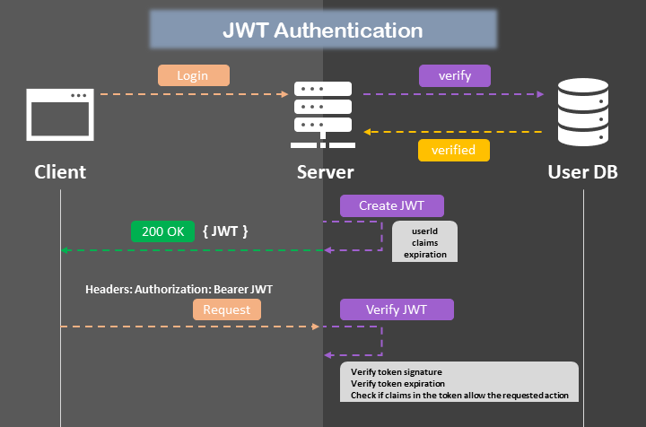

## 목차

- [인증 Authentication](#인증-authentication)
  - [Session & Cookies](#session--cookies)
    - [인증 과정](#인증-과정)
    - [단점](#단점)
  - [JWT](#jwt)
  - [구조](#구조)
    - [인증 과정](#인증-과정-1)
    - [장점](#장점)
    - [단점](#단점-1)

# 인증 Authentication

웹개발을 하게되면 인증 부분은 빼놓을 수 없는 개념 중 하나이다.  
인증은 다양한 서비스에서 사용되지만 대표적으로 로그인 서비스에서 주로 사용되고,  
인증하는 방식 또한 다양하게 사용된다. 요즘은 기술의 발전으로 홍채인식, 페이스인식, 지문인식 등으로  
사용자를 인증하여 로그인하거나 해당 서비스에 접근 권한을 얻는 등 활용된다.  

## Session & Cookies

사용자 세션(User Session)을 서버에 보관하는 방법

### 인증 과정



### 단점

이 방식은 서버에 별도의 Session 상태(State)를 둬야하기 때문에  
분산형 시스템으로 설계를 잘 했음에도 불구하고 Client의 요청에 대해 현재 Session 정보를  
확인해야하는 내부적으로 많은 네트워크 요청을 해야함으로 성능 저하가 발생한다.

## JWT

Session과 Cookies를 대체할 수 있는 JWT(Jsom Web Token) 방식이다.  
즉, JSON을 이용해서 웹 토큰을 주고 받는 것을 말한다.

## 구조

- **Header**: 사용하는 알고리즘과 타입에 대한 정보가 명시되어있다.
```json
# 예시
{
  "alg":"HS256",
  "typ":"JWT"
}
```
- **Payload**: 전송하거나 주고 받고 싶은 다양한 데이터들이 명시되어있다. (인코딩 되어짐)
```json
# 예시
{
  "loggedInAs": "admin",
  "iat": 142255343
}
```
- **signature**: 인코딩된 헤더, 페이로드와 함께 시크릿키가 명시되어있다.
```json
# 예시
HMAC-SHA256(
  secret, base64urlEncoding(header) + '.'
  + base64urlEncoding(payload)
)
```

### 인증 과정



### 장점

서버에 별도의 Session 상태(State)를 두지 않기 때문에  
서버를 확장하거나 마이크로서비스를 이용하거나, 또는 분산형 시스템으로 만들시 동일한 시크릿키만 가지고 있다면  
서로 사용자 검증을 위한 네트워크 요청을 하지 않아도 된다.

### 단점

JWT 자체가 단점일 수 있는데, 그 이유는 클라이언트가 요청을 할때 항상 JWT를 포함시켜서 요청을 하는데  
만약, 영원히 만료되지 않는 JWT를 사용시 해커에게 노출된다면 만료되지 않은 JWT 때문에 보안상 문제가 생긴다.  
그렇게 때문에 JWT를 설계할시 보안에 대해 많이 신경써서 사용해야한다.