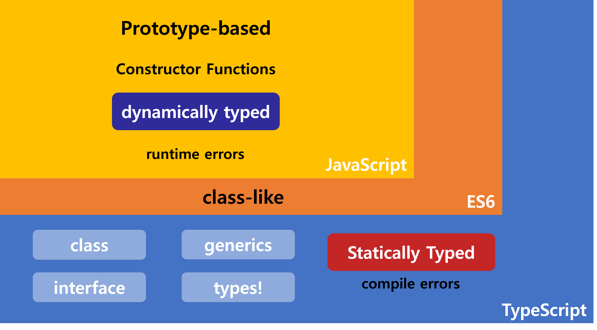

## 목차

- [TypeScript](#typescript)
    - [Points](#points)
- [npm](#npm)
- [commands](#commands)
- [Auto compile and run setup](#auto-compile-and-run-setup)
    - [set compiled files directory](#set-compiled-files-directory)
    - [concurrently, nodemon with TS](#concurrently-nodemon-with-ts)
  - [Git Microsoft Template](#git-microsoft-template)
- [Debugging](#debugging)

# TypeScript

***"Any browser, Any OS, Anywhere"***

- Relation with javascript



### Points
- **Object-Oriented Programming**을 자바스크립트로 할 때보다 더 강력하고 확실하게 할 수 있다.
- 타입스크립트는 자바스크립트의 **Superset** 이다.  
즉, 타입스크립트와 자바스크립트는 서로 호환이 가능하여, 한 프로젝트 내에 동시 사용이 가능하다.

타입스크립트를 추가하거나 자바스크립트를 대체해서 사용할 수는 있지만, 자바스크립트 엔진은 타입스크립트를 바로 이해할 수 없다. 그렇기 때문에 타입스크립트를 자바스크립트로 컴파일하는 transcompiles 과정을 거쳐야 한다. 이러한 컴파일은 타입스크립트 자체에서 제공하는 툴을 이용하거나 외부 툴인 바벨(Babel)과 같은 것으로 타입스크립트를 자바스크립트 코드로 변환할 수 있다.

추가적으로, NodeJS 다음으로 나온 Deno는 타입스크립트를 바로 실행할 수 있다. (내장 타입스크립트 지원)

> Deno는 V8 JavaScript 엔진 및 Rust 프로그래밍 언어를 기반으로하는 JavaScript 및 TypeScript 용 런타임이다. [https://ko.wikipedia.org/wiki/deno](https://ko.wikipedia.org/wiki/%EB%94%94%EB%85%B8_(%EC%86%8C%ED%94%84%ED%8A%B8%EC%9B%A8%EC%96%B4))

# npm

- 글로벌로 설치

```shell
$ npm i -g typescript
```

# commands

- 타입스크립트 시작 명령어

```shell
$ tsc
```

- 버전 확인

```shell
$ tsc -v
```

- 타입스크립트 설정 파일 생성 ( tsconfig.json 생성 )

```shell
$ tsc --init
```

- 타입스크립트 파일 컴파일 ( main.ts -> main.js )

```shell
$ tsc main.ts
```

또는

```shell
$ tsc
```

- 타입스크립트 모니터링 (자동 컴파일 모드)

모니터링 모드에서 편집/수정 후 저장시 자동으로 변환됨.

```shell
$ tsc -w
```

# Auto compile and run setup

### set compiled files directory

- 일단 컴파일된 js파일들이 dist 폴더에 담길 수 있도록 설정해주자.

    root
    |-- src
    |   |-- main.ts
    |-- dist
    |   |-- main.js

`./tsconfig.json`

- tsconfig.json 파일에 outDir 부분 주석을 풀고 dist로 바꿔준다.
```json
"outDir": "dist",
```

### concurrently, nodemon with TS

- concurrently와 nodemon은 개발할때만 실행하는 것이므로 `--save-dev` 옵션을 추가한다.

> nodemon : Node 자동 실행 패키지
> concurrently : 두 개 이상의 명령어들을 동시 입력 및 실행 패키지

```shell
$ npm i --save-dev concurrently nodemon
```

`package.json`

- script에 start 옵션 추가

```json
"scripts": {
  "start": "concurrently \"tsc -w\" \"nodemon dist/main\"",
  ...
}
```
*start 명령어 설명:  
tsc -w -> 타입스크립트 모니터링(watching)모드 실행  
nodemon dist/main (dist/main.js) -> 해당 경로(컴파일 경로)에서 Node 자동 실행 모드 실행

## Git Microsoft Template

https://github.com/microsoft/TypeScript-Node-Starter

# Debugging

`./tsconfig.json`

- tsconfig.json 파일에 sourceMap 부분을 활성화 시켜준다.

```json
"sourceMap": true,
```

그래야 타입스크립트 코드와 컴파일된 자바스크립트 코드 어디가 어떻게 매핑이 되는지 기억하고 있는 파일이 만들어진다. (ex) main.js.map)